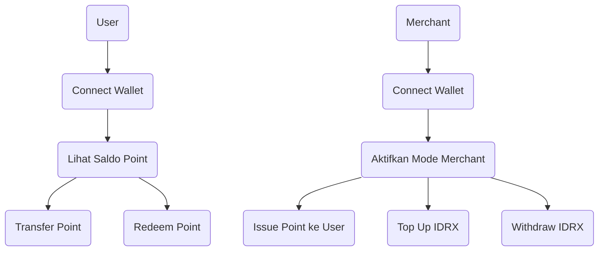

# Pointify

This project is a web3 application for loyalty points backed by IDRX. The repository combines smart contracts (Solidity) and frontend (React) in a single place.

## Folder Structure

```
pointify/
│
├── contracts/           # All Solidity smart contracts
├── scripts/             # Scripts for deployment and smart contract utilities
├── test/                # Smart contract tests
├── frontend/            # React application source code
│   ├── public/          # Static files (favicon, index.html, etc)
│   ├── src/             # React source code
│   │   ├── components/  # UI components
│   │   ├── pages/       # Main pages
│   │   ├── hooks/       # Custom React hooks
│   │   ├── utils/       # Helper functions
│   │   ├── abi/         # Compiled contract ABIs
│   │   └── ...          # Other files (App.js/ts, index.js/ts, etc)
│   └── ...              # React config files
├── deployments/         # (Optional) Deployment results (addresses, networks, etc)
├── .env                 # Environment variables
├── hardhat.config.js    # Hardhat configuration
├── package.json         # Main dependencies
└── ...                  # Other config files
```

## Setup

1. **Install main dependencies:**
   ```bash
   npm install
   ```
2. **Go to the frontend folder and install React dependencies:**
   ```bash
   cd frontend
   npm install
   ```
3. **Compile smart contracts:**
   ```bash
   npx hardhat compile
   ```
4. **Run the frontend:**
   ```bash
   npm start
   ```

---

## User Journey

### Sebagai Pengguna (User)
1. **Connect Wallet**: Klik "Connect Wallet" dan hubungkan MetaMask.
2. **Lihat Saldo**: Saldo loyalty point akan tampil otomatis.
3. **Transfer Point**: Masukkan alamat tujuan dan jumlah, lalu klik "Transfer".
4. **Redeem Point**: Masukkan jumlah point yang ingin ditukar ke IDRX, lalu klik "Redeem".

### Sebagai Merchant
1. **Connect Wallet**: Klik "Connect Wallet" dan hubungkan MetaMask.
2. **Aktifkan Mode Merchant**: Centang toggle "Mode Merchant".
3. **Issue Point**: Masukkan alamat user dan jumlah point, lalu klik "Issue".
4. **Top Up IDRX**: Masukkan jumlah IDRX yang ingin ditambahkan ke kuota, lalu klik "Top Up".
5. **Withdraw IDRX**: Masukkan jumlah IDRX yang ingin ditarik dari kuota, lalu klik "Withdraw".

### Diagram Alur



---

Please complete the files and configuration as needed for your project. 